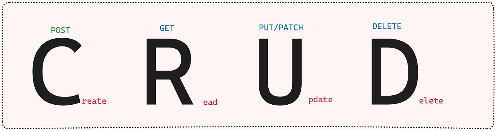

## Comprendre le CRUD

CRUD, c'est un acronyme simple pour les quatre opérations de base qu'on fait avec des données dans une application ou une base de données :

*   **C**reate (Créer) : Ajouter de nouvelles données.
*   **R**ead (Lire) : Afficher des données existantes.
*   **U**pdate (Mettre à jour) : Modifier des données.
*   **D**elete (Supprimer) : Enlever des données.

En gros, le CRUD, c'est le b.a.-ba pour gérer n'importe quelle information numérique.

### 1. Create (Créer)

Quand tu crées quelque chose de nouveau : un compte utilisateur, un article de blog, un nouveau produit. Tu ajoutes des infos au système.

**Exemple :** Ajouter un nouveau livre dans une bibliothèque en ligne. Tu remplis le titre, l'auteur, etc., et hop, le livre est enregistré.

```javascript
// Avec Node.js, Express et une base de données comme MongoDB
app.post('/books', (req, res) => {
  const nouveauLivre = new Livre({
    titre: req.body.titre,
    auteur: req.body.auteur,
    annee: req.body.annee
  });
  nouveauLivre.save()
    .then(livre => res.status(201).send(livre))
    .catch(erreur => res.status(400).send(erreur));
});
```

### 2. Read (Lire)

Quand tu veux voir ce qui existe déjà : la liste de tes amis, les derniers articles d'un site, les détails d'un produit. Tu récupères des infos.

**Exemple :** Afficher tous les livres de la bibliothèque, ou chercher les infos d'un livre en particulier.

```javascript
// Lire tous les livres
app.get('/books', (req, res) => {
  Livre.find()
    .then(livres => res.status(200).send(livres))
    .catch(erreur => res.status(500).send(erreur));
});

// Lire un livre par son identifiant (ID)
app.get('/books/:id', (req, res) => {
  Livre.findById(req.params.id)
    .then(livre => {
      if (!livre) return res.status(404).send('Livre non trouvé');
      res.status(200).send(livre);
    })
    .catch(erreur => res.status(500).send(erreur));
});
```

### 3. Update (Mettre à jour)

Quand tu modifies des infos qui sont déjà là : changer ton mot de passe, corriger une faute dans un article, ajuster le prix d'un article. Tu mets à jour des données.

**Exemple :** Corriger l'année de publication d'un livre qui était fausse.

```javascript
// Mettre à jour un livre par son ID
app.put('/books/:id', (req, res) => {
  Livre.findByIdAndUpdate(req.params.id, req.body, { new: true })
    .then(livre => {
      if (!livre) return res.status(404).send('Livre non trouvé');
      res.status(200).send(livre);
    })
    .catch(erreur => res.status(400).send(erreur));
});
```

### 4. Delete (Supprimer)

Quand tu enlèves des infos : fermer un compte, retirer un article, effacer un produit du catalogue. Tu supprimes des données.

**Exemple :** Supprimer un livre qui n'est plus disponible.

```javascript
// Supprimer un livre par son ID
app.delete('/books/:id', (req, res) => {
  Livre.findByIdAndRemove(req.params.id)
    .then(livre => {
      if (!livre) return res.status(404).send('Livre non trouvé');
      res.status(200).send('Livre supprimé avec succès');
    })
    .catch(erreur => res.status(500).send(erreur));
});
```

Le CRUD, c'est vraiment la base pour travailler avec les données en développement web. Si tu comprends bien ces quatre points, tu as une bonne longueur d'avance !


